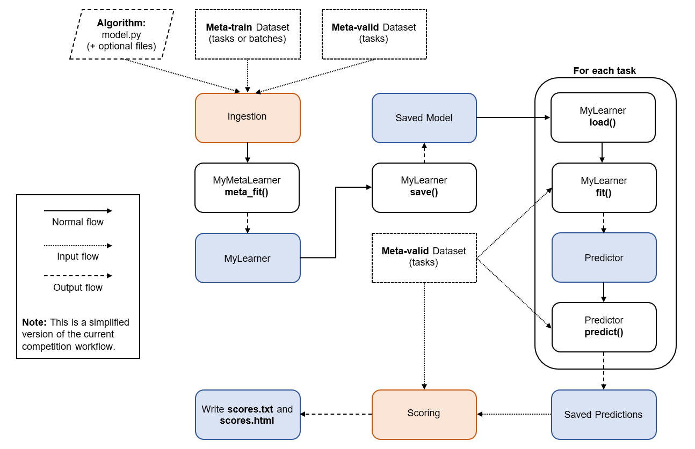

# Cross-Domain MetaDL Competition Starting Kit

---
In this document, we present how to setup the tools to use the Jupyter Notebook tutorial. Also we present an overview of the challenge to understand how to write a valid code submission.

In this `README.md` file, you can find the following things: 
* Instructions to setup the environment to make the jupyter notebook ready to use.
* An overview of the competition workflow.  

In the **Jupyter Notebook** `tutorial.ipynb` you will learn the following things: 
* The format in which the data arrive to the meta-learning algorithm.
* Familiarize with the challenge API and more specifically how to organize your code to write a valid submission.
---

**Outline**
  - [Setup](#setup)
    - [Download the starting kit](#download-the-starting-kit)
    - [Set up the environment with Anaconda](#set-up-the-environment-with-anaconda)
    - [Set up the environment with Docker](#set-up-the-environment-with-docker)
    - [Update the starting kit](#update-the-starting-kit)
    - [Public dataset](#public-dataset)
  - [Understand how a submission is evaluated](#understand-how-a-submission-is-evaluated)
  - [Prepare a ZIP file for submission on CodaLab](#prepare-a-zip-file-for-submission-on-codalab)
  - [Troubleshooting](#troubleshooting)
  - [Report bugs and create issues](#report-bugs-and-create-issues)
  - [Contact us](#contact-us)

## Setup

### Download the starting kit
You should clone the whole **cd-metadl** repository first by running the following command in the empty root directory of your project:
```
git clone https://github.com/DustinCarrion/cd-metadl.git
```
We provide 2 ways of installing the necessary dependencies :
* [via Conda environment](#set-up-the-environment-with-anaconda)
* [via Docker environment](#set-up-the-environment-with-docker)

You can choose your preferred option and directly jump into the corresponding section.
### Set up the environment with Anaconda

**Note** : We assume that you have already installed anaconda on your device. If it's not the case, please check out the right installation guide for your machine in the following link: [Anaconda installation guide](https://docs.anaconda.com/anaconda/install/).

A script `quick_start.sh` is available and allows to quickly set up a conda environment with all the required modules/packages installed. Make sure you have cloned the cd-metadl repository beforehand. 

Your root directory should look like the following: 
```
<root_directory>
|   cd-metadl
```

Then, set your current working directory to be in cd-metadl's starting kit folder using the following command:
```bash
cd cd-metadl/starting_kit/
```

Then you can run the `quick_start.sh` script:
```bash
bash quick_start.sh
```
This script creates a Python 3.8.10 conda environment named **cdml**, install all packages/modules required, and notebook.

**Note**: During the execution, the terminal will ask you to confirm the installation of packages, make sure you accept.

Once everything is installed, you can now activate your environment with this command: 
```bash
conda activate cdml
```
And launch Jupyter notebook the following way: 
```bash
jupyter-notebook
```
You will access the Jupyter menu, click on `tutorial.ipynb` and you are all set.

### Set up the environment with Docker
First, make sure you cloned the GitHub repository. Your root directory should look like the following: 
```
<root_directory>
|   cd-metadl
```

Then, set your current working directory to be in cd-metadl's folder using the following command:
```bash
cd cd-metadl/
```

Then, download the Public datasets: 
```bash
wget https://codalab.lisn.upsaclay.fr/my/datasets/download/3613416d-a8d7-4bdb-be4b-7106719053f1 -O public_data.zip
```

Finally, unzip it: 
```bash
unzip public_data.zip
```

---

If you are new to docker, install the docker engine from [https://docs.docker.com/get-started/](https://docs.docker.com/get-started/). Make sure that your system is compatible with the version that you install. Once you have installed docker, you can pull the docker image that we provide for this challenge. This image contains all required packages and the Python environment for the competition. You can use this image to perform local tests on your machine.
The image can be obtained by running
```bash
docker pull dustrix397/cdmetadl:participants
```
This image can then be made into a running container using the following command:
```bash
docker run --name cdmetadl -it -v "$(pwd):/app/codalab" -p 8888:8888 dustrix397/cdmetadl:participants
```
The option `-v "$(pwd):/app/codalab"` mounts current directory (`cd-metadl/`) as `/app/codalab`.
If you want to mount other directories on your disk, please replace `$(pwd)` by your own directory. The option `-p 8888:8888` is useful for running a Jupyter notebook tutorial inside Docker.
This container environment can be exited at any time by pressing `Ctrl+D` (on Linux) or by typing exit.

The Docker image has python=3.8.10. If you want to run local test with Nvidia GPU support, please make sure you have installed nvidia-docker and run instead:
```bash
nvidia-docker run --name cdmetadl -it -v "$(pwd):/app/codalab" -p 8888:8888 dustrix397/cdmetadl:participants
```
Make sure you use enough RAM (at least 4GB). If the port 8888 is occupied, you can use other ports, e.g. 8899, and use instead the option `-p 8899:8888`.

#### Run the tutorial notebook
We provide a tutorial in the form of a Jupyter notebook. When you are in your docker container, enter:

```bash
jupyter-notebook --ip=0.0.0.0 --allow-root &
```
Then copy and paste the URL containing your token. It should look like something like that:

```bash
http://0.0.0.0:8888/?token=5cc8ad3dda2366b7b426bf84afe72d614fa79a2c0109fafc
```
Select `starting_kit/tutorial.ipynb` in the menu and you are all set.

### Update the starting kit

As new features and possible bug fixes will be constantly added to this starting kit, you are invited to get the latest updates before each usage by running:

```
cd <path_to_local_cd-metadl>
git pull
```

If you forked the repository, here is how you update it: [syncing your fork](https://help.github.com/en/articles/syncing-a-fork)

### Public dataset
We provide 10 public datasets for participants. They can use it to:
- Explore data.
- Do local test of their own algorithm.

If you followed any of the 2 installation methods, you should already have a new directory that contains the competition public data. This data is organized as follows:
```
cd-metadl/
|   baselines/
|   cdmetadl/
|   public_data/
│       BCT
│       │   images/
│       │   info.json
│       │   labels.csv
│   
│       BRD
│       │   images/
│       │   info.json
│       │   labels.csv
│   
│       CRS
│       │   images/
│       │   info.json
│       │   labels.csv
│   
│       info
│       │   meta_splits.txt
│ 
│       ...
|   starting_kit/
|   .gitignore
|   LICENSE
|   README.md
|   requirements.txt
|   setup.py
```
Each dataset inside `public_data` (BCT, BRD, CRS, FLW, MD_MIX, PLK, PLT_VIL, RESISC, SPT, TEX) belongs to a different domain and is formatted following [this structure](https://github.com/ihsaan-ullah/meta-album/tree/master/DataFormat). The `info` folder contains the definition of which datasets should be used for meta-training and which ones should be used for meta-testing. Note that the meta-training datasets can be further split into meta-train and meta-valid.

If you created your environment on your own, you can download the public data from the competition dashboard: 
[Public data](https://codalab.lisn.upsaclay.fr/my/datasets/download/3613416d-a8d7-4bdb-be4b-7106719053f1)

## Understand how a submission is evaluated 
First let's describe what scripts a partcipant should write to create a submission. They need to create the following files: 
- **model.py** (Mandatory): Contains the meta-learning algorithm procedure dispatched into the appropriate classes.
- **metadata** (Mandatory): It is just a file for the competition server to work properly, you simply add it to your folder without worrying about it.
- **config.json** (Optionnal) : This file allows participants to meta-fit their algorithm on data with a specific **configuration**. Examples are provided in the `tutorial.ipynb`.
* **<any_file>** (Optionnal) : Sometimes you would need to create a specfic architecture of a neural net or any helper function for your meta-learning procedure. You can include all the files you'd like but make sure you import them correctly in **model.py** as it is the only script executed.

An example of a submission using these files is described in the provided Jupyter notebook `tutorial.ipynb`.

The following figure explains the evaluation procedure of the challenge.



## Prepare a ZIP file for submission on CodaLab
Zip the contents of `baselines/random` (or any folder containing your `model.py` file) without the directory structure:
```bash
cd ../baselines/random
zip -r mysubmission.zip *
```
**Note** : The command above assumes your current working directory is `starting_kit`.

Then, the generated zip can be uploaded to the competition page on CodaLab platform.

**Tip**: One could run the following command to check the content of a zipped submission folder.
```bash
unzip -l mysubmission.zip
```

## Troubleshooting
- It is highly recommended to use the previous guidelines to prepare a zip file submission instead of simply compressing the code folder in the *Finder* (for MAC users).
- Make sure your submission always writes a file in the Learner's `save()` method. Otherwise, the submission will fail and CodaLab will return an error during the **ingestion** phase.
- Remember that the `run.py` script combines the run of the ingestion and scoring process in one command. Thus, if you have an error it can be from the ingestion or scoring process. 

## Report bugs and create issues 

If you run into bugs or issues when using this starting kit, please create issues on the [*Issues* page](https://github.com/DustinCarrion/cd-metadl/issues) of this repo. 

## Contact us 
If you have any questions, please contact us via: <metalearningchallenge@googlegroups.com>
